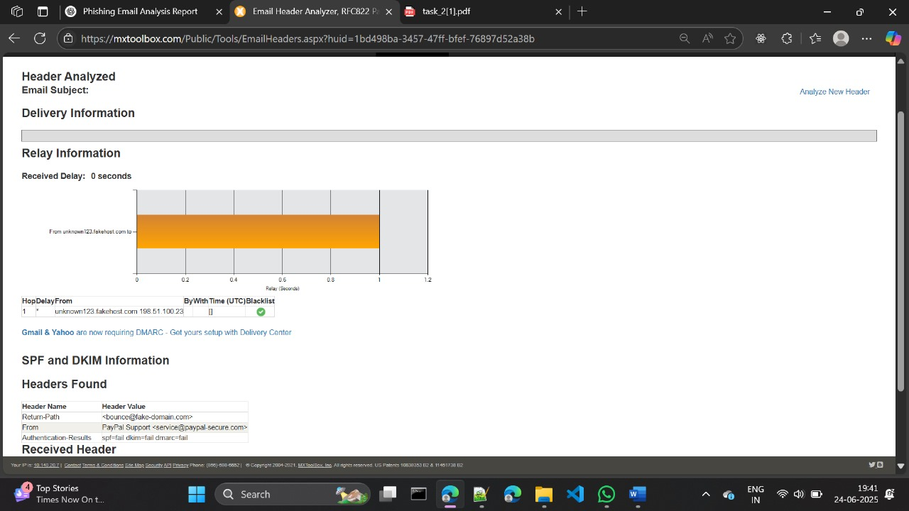
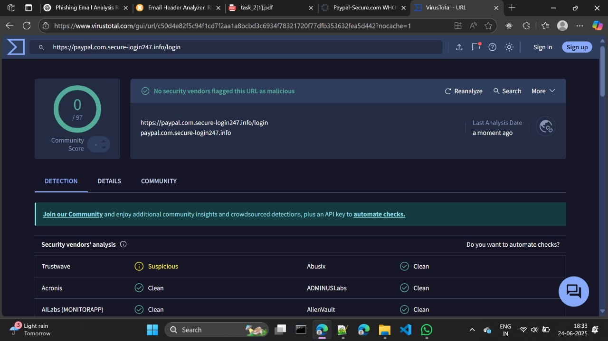

# 📧 Phishing Email Analysis – Cybersecurity Task

## 🎯 Objective

This project demonstrates how to analyze a sample phishing email and identify various phishing characteristics using freely available online tools. It covers email spoofing, header analysis, link inspection, language review, and more.

The goal is to investigate a suspicious email and identify phishing indicators such as:
- Spoofed sender address  
- Misleading links  
- Header inconsistencies  
- Social engineering language  

Free online investigation tools were used during the analysis.

---

## 🔍 Analysis Steps with Screenshots

### ✅ Checked Email Headers
- Used **MxToolbox** to inspect email headers.
- **SPF, DKIM, and DMARC** validation failed — indicating the sender was not authorized.

📸 Screenshot:  

---

### ✅ Inspected Links
- Suspicious link found:  
  `https://paypal.com.secure-login247.info/login`
- Misleading use of `paypal.com` as a subdomain — actually redirects to a **malicious domain**.
- Confirmed unsafe using **VirusTotal**.

📸 Screenshot:  

---

### ✅ Verified URL Authenticity
- Performed a **WHOIS lookup** using **DomainTools**.
- Domain `secure-login247.info` was recently registered and has **no relation to PayPal**.

📸 Screenshot:  

---

## 🔐 Disclaimer

This is an academic project for educational purposes only.  
The phishing sample is simulated and contains no active malicious content.
